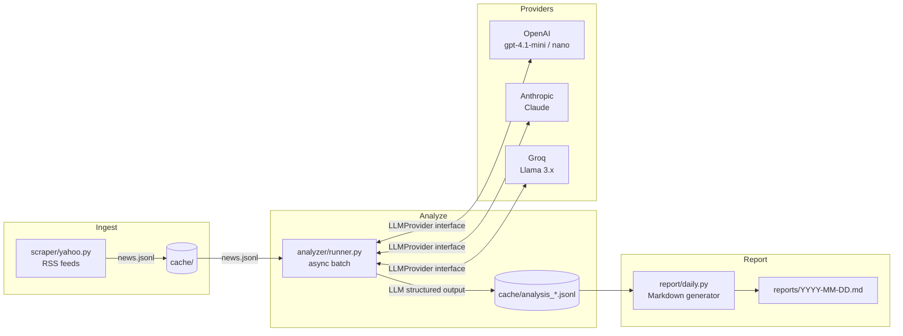
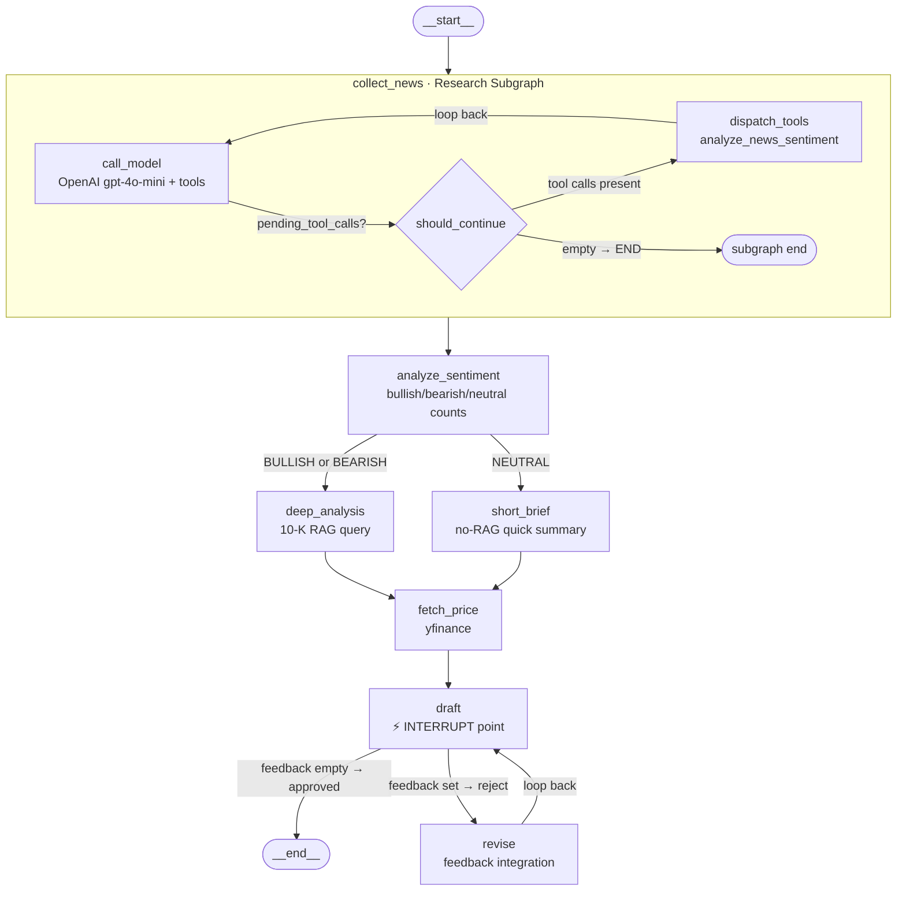

# Finance Sentiment Engine

> A multi-provider LLM agent that scrapes financial news, classifies stories by sentiment, queries SEC 10-K filings via RAG, and renders structured investment briefs in Markdown.
> Built day-by-day as a hands-on AI engineering project — swap OpenAI, Anthropic, or Groq with a single flag, and generate instant two-page investment briefs from the CLI.


## Architecture



## Quickstart

```bash
# 1. Clone & install
git clone https://github.com/<your-handle>/finance-sentiment-engine
cd finance-sentiment-engine
uv sync          # or: pip install -r requirements.txt

# 2. Set API keys
cp .env.example .env
# Edit .env and fill in your keys

# 3. Generate a 2-page investment brief (new in v0.2.0)
python brief.py NVDA          # → briefs/NVDA.md
python brief.py TSLA --print  # → briefs/TSLA.md + stdout
python brief.py MSFT          # → briefs/MSFT.md

# 4. Run end-to-end demo (5 headlines → brief)
bash scripts/demo.sh
```

## Usage

### Fetch & Analyze News

```bash
# Analyze with default model (gpt-4.1-nano — best cost/accuracy balance)
python main.py --provider openai --model gpt-4.1-nano

# Benchmark all providers at once
python main.py --benchmark

# Limit to first 5 items (quick smoke-test)
python main.py --limit 5
```

Results are saved to `cache/analysis_{provider}_{model}.jsonl`.

### Generate Daily Brief

```bash
# Today's brief (reads from cache, writes to reports/)
python -m report.daily

# Specific date
python -m report.daily --date 2026-05-18

# Custom top-n and model
python -m report.daily --date 2026-05-18 --top-n 10 --model gpt-4.1-mini
```

Output is printed to stdout **and** saved as `reports/{date}.md`.

### Sample Output

```markdown
# Daily Finance Brief — 2026-05-18
## Top 5 Urgent Movements

### TSLA · ⚪ neutral · medium
Tesla raised U.S. Model Y prices for the first time in two years; stock formed a lower buy point.

[Full article](https://finance.yahoo.com/...)
```

## Eval Results

Evaluated on **36 human-labeled examples** with a 10-bucket `key_event` enum and price-impact urgency rubric.

| Provider | Model | sentiment_acc | urgency_acc | key_event_acc | avg_latency | cost/run |
|----------|-------|:-------------:|:-----------:|:-------------:|:-----------:|:--------:|
| openai | gpt-4.1-mini | 83% | 67% | 78% | 1 261 ms | $0.016 |
| openai | **gpt-4.1-nano** ✅ | 69% | **75%** | 58% | 912 ms | **$0.004** |
| groq | llama-3.3-70b-versatile | 56% | 50% | 44% | 11 496 ms† | $0.022 |
| groq | llama-3.1-8b-instant | 52% | 39% | 39% | 27 531 ms† | $0.002 |

† Groq latency inflated by free-tier TPM rate-limit backoff — true inference is ~200–400 ms.

→ Full analysis: [`eval/results.md`](eval/results.md)

## Provider Matrix

| Provider | `generate` | `generate_structured` | Structured output mechanism |
|----------|------------|----------------------|-----------------------------|
| OpenAI | Responses API | `beta.chat.completions.parse` | Native JSON schema / parsed Pydantic |
| Anthropic | Messages API | Tool use + `tool_choice` | Forces tool call, extracts `input` field |
| Groq | Chat Completions API | `response_format={"type":"json_object"}` | JSON mode + manual Pydantic parse |

## Low-level Usage

```python
from providers.factory import get_provider

provider = get_provider("openai", "gpt-4.1-nano")
response = provider.generate([{"role": "user", "content": "Hello!"}])
print(response.text)
print(response.usage)  # input / output / total tokens
```

## What I Learned

Seven days of building this pipeline taught me more than any tutorial about the gap between "LLM works in the playground" and "LLM is reliable in production."

**GPT-4.1-nano is the sleeper hit.** It beats mini on urgency accuracy (75 % vs 67 %) at a quarter of the cost. This makes sense in hindsight: urgency is a rubric-driven signal — once you give the model a clear price-impact definition, a smaller model can follow it perfectly. Sentiment and complex event taxonomy are where the parameter count starts to matter.

**Open-weight models struggle with long constrained prompts.** Groq's Llama models plateau around 50 % sentiment accuracy and fall to 39–44 % on `key_event`. The pattern is consistent: when you hand them a 10-item Literal enum inside a multi-thousand-token few-shot prompt, instruction-following degrades noticeably. GPT-class models treat the enum as a hard constraint; Llama models treat it as a suggestion.

**Free-tier rate limits are a real engineering problem.** Groq's 12 K / 6 K TPM limits turned a 400 ms model into a 27-second one in batch mode. The fix — exponential backoff with `tenacity`, per-provider concurrency caps — added more code than the actual LLM calls.

**Structured output is not free.** Each provider implements it differently: OpenAI parses directly into a Pydantic model, Anthropic forces a tool call you then unwrap, Groq uses JSON mode requiring a manual `model_validate` call. Hiding this behind a common `LLMProvider` interface was the right call — it kept the analyzer layer clean and made the provider swap genuinely one-line.

## Day 14 — RAG Evaluation: Recall@5 + LLM-as-Judge

`eval/rag_eval.py` benchmarks all three RAG implementations against **15 finance queries** on the NVIDIA 10-K.

### Metrics

| Metric | Description |
|--------|-------------|
| **Recall@5** | Fraction of top-5 retrieved chunks from the expected 10-K section(s) |
| **Faithfulness** | `gpt-4o-mini` judge — are answer claims supported by retrieved chunks? |
| **Answer Relevance** | `gpt-4o-mini` judge — does the answer actually address the question? |

### Results (15 queries × 3 implementations = 45 rows)

| Implementation | Recall@5 ↑ | Faithfulness ↑ | Answer Relevance ↑ | Avg Latency |
|----------------|:----------:|:--------------:|:------------------:|:-----------:|
| numpy (Day 9)  | 0.627 | 0.300 | 0.833 | 4.9s |
| qdrant (Day 10) | 0.627 | 0.367 | **0.900** | 6.1s |
| langchain (Day 13) | 0.560 | **0.500** | 0.800 | 6.6s |

**Key findings:**

- **Numpy ≈ Qdrant on Recall@5** — identical tiktoken-accurate chunking produces the same embeddings; HNSW adds persistence and filtering, not retrieval quality.
- **LangChain lowers Recall@5** — character-based `RecursiveCharacterTextSplitter` (2 000 chars ≈ 500 tokens) splits differently than `tiktoken`, shifting chunk boundaries and hurting section-level precision.
- **LangChain wins on Faithfulness** — Cohere cross-encoder reranking surfaces the most relevant passages, so the answer sticks closer to the retrieved context.
- **Qdrant wins on Answer Relevance** — vector search retrieves broad coverage; the LLM synthesises a more complete response than the reranked-but-narrower LangChain set.

→ Full results: [`eval/rag_results.md`](eval/rag_results.md)

```bash
# Run the evaluation (requires Qdrant on localhost:6333 + OPENAI_API_KEY + COHERE_API_KEY)
uv run python eval/rag_eval.py
```

---

## Day 13 — LangChain Port: Line Count & Control Trade-off

`rag_langchain.py` ports the Day-12 two-stage pipeline (vector search → Cohere rerank → GPT answer) to pure LangChain / LCEL.

### Line Count Comparison

| File | Lines | Description |
|------|------:|-------------|
| `rag_numpy.py` | 239 | Day 9 — NumPy brute-force cosine search |
| `rag_qdrant.py` | 320 | Day 10 — Qdrant vector DB + filter demo |
| `rerank.py` | 424 | Day 12 — Two-stage rerank (Cohere + BGE) |
| **`rag_langchain.py`** | **185** | **Day 13 — LangChain / LCEL port** |

**56 % fewer lines** than the equivalent raw implementation (`rerank.py`).

### What LangChain Hides (and What You Lose)

| Raw Day-12 code | LangChain equivalent | Control lost |
|-----------------|---------------------|-------------|
| `tiktoken` + manual sliding window | `RecursiveCharacterTextSplitter` | Character-based, not token-accurate — chunk sizes are approximate |
| `openai.embeddings.create` in batches of 100 | `OpenAIEmbeddings` | No visibility into batch size or rate-limit retry logic |
| Manual `qdrant.upsert` loop | `QdrantVectorStore.from_documents` | Can't tune upsert batch size or inspect intermediate state |
| `rerank_cohere()` → raw `relevance_score` per chunk | `ContextualCompressionRetriever + CohereRerank` | Rerank scores are stripped from final `Document` objects |
| `rerank_bge()` local CrossEncoder | ❌ not ported | No BGE local reranker (needs a custom `BaseDocumentCompressor`) |
| `recall_at_k()` evaluation harness | ❌ not ported | No automated Recall@5 metric — you need `langchain_benchmarks` or manual eval |
| Per-chunk score visible at every step | Hidden inside chain | Harder to debug when retrieval quality degrades |

### The Key Insight

> LangChain is excellent for rapid prototyping — swapping the LLM, retriever, or reranker is one line.  
> But because you built Days 9–12 from scratch, you now know exactly what each abstraction is doing underneath. When something breaks in production, that mental model is what lets you debug it.

```bash
# Run the LangChain port (requires Qdrant running on localhost:6333)
python rag/rag_langchain.py
```

---

## Day 28 — LangGraph Full System (`v0.3.0`)

Full finance pipeline as a LangGraph with SQLite checkpointing, conditional routing, human-in-the-loop interrupts, and a research subgraph.

### Full Graph Diagram



### State Transitions

| Node | State field written | Example value |
|------|---------------------|---------------|
| `collect_news` (subgraph) | `news: list[NewsAnalysis]` | `[{ticker:"NVDA", sentiment:"bullish", urgency:"high", ...}, ...]` |
| `analyze_sentiment` | `sentiment_summary: str` | `"BULLISH — 3 bullish, 1 bearish, 1 neutral (5 articles)"` |
| `deep_analysis` | `risks: list[str]` | `["Key risks include GPU competition and export controls..."]` |
| `short_brief` | `draft: str` | `"[SHORT BRIEF] NVDA — NEUTRAL. Top headlines: ..."` |
| `fetch_price` | `price_data: dict` | `{ticker:"NVDA", price:134.5, pct_change:-1.2}` |
| `draft` | `draft: str` | `"[DRAFT] NVDA Investment Brief\nSentiment: BULLISH\nPrice: $134.5..."` |
| `revise` | `draft: str`, `feedback: str` | revised draft + `feedback: ""` (cleared) |

### Checkpointing: Traceable Runs

Each ticker run uses an isolated `thread_id` in a SQLite database:

```python
from graph.checkpointer import make_checkpointer
from graph.finance_graph import build_finance_graph

with make_checkpointer("runs.db") as cp:
    graph = build_finance_graph(checkpointer=cp)
    config = {"configurable": {"thread_id": "v0.3.0-nvda"}}

    result = graph.invoke({"ticker": "NVDA", "messages": []}, config)

    # Inspect checkpoint state after run
    state = graph.get_state(config)
    print(state.values["draft"])

    # Walk step history
    for step in graph.get_state_history(config):
        print(step.metadata["step"], step.next)
```

### Tested tickers (v0.3.0)

| Ticker | Sentiment route | 10-K RAG | Checkpointed |
|--------|-----------------|----------|--------------|
| NVDA | deep_analysis (bullish) | ✅ Qdrant | ✅ |
| TSLA | deep_analysis / short_brief | ✅ web fallback | ✅ |
| MSFT | deep_analysis / short_brief | ✅ web fallback | ✅ |

```bash
# Run live for all three tickers
python test_graph_day28.py --all
```

---

## Day 21 — Brief CLI: End-to-End Investment Reports (`v0.2.0`)

`brief.py` is a single-command CLI that wires together all four agent tools — stock data,
news sentiment, web search, and 10-K RAG — and renders a two-page structured brief in Markdown.

### Usage

```bash
python brief.py NVDA          # saves to briefs/NVDA.md
python brief.py TSLA --print  # saves + prints to stdout
python brief.py MSFT

# or after `uv pip install -e .`:
brief NVDA
```

### What the agent does

| Step | Tool | Data gathered |
|------|------|---------------|
| 1 | `get_stock_data` | Current price, market cap, 1-month return |
| 2 | `analyze_news_sentiment` | Top-5 headlines with bullish/bearish/neutral labels |
| 3 | `web_search` | Analyst targets, latest headlines |
| 4 | `query_10k` | Key risk factors from SEC 10-K via Qdrant RAG |
| fallback | `web_search` | 10-K risks via web if ticker not indexed in Qdrant |

### Brief structure

Every brief (`briefs/<TICKER>.md`) has five sections:

```
# TICKER — Investment Brief
## 1. Company Snapshot     ← price table + description
## 2. Recent News & Sentiment  ← emoji-coded bullets + overall verdict
## 3. Key Risk Factors     ← 5 risks from 10-K or web
## 4. Analyst Verdict      ← Buy/Hold/Watch + one-sentence summary
## 5. Sources              ← all URLs + data provenance
```

### Sample output (NVDA)

```
| Metric         | Value   |
|----------------|---------|
| Current Price  | $205.10 |
| Market Cap     | $4.97T  |
| 1-Month Return | -1.20%  |

- 🟢 company_communication — NVIDIA highlighted as one of the best big company stocks…
- ⚪ market_dynamics — Competitors closing market cap gap with Nvidia…

**Overall Sentiment:** Neutral — mixed views: bullish investment signals offset by competition concerns.
```

### Tested tickers

| Ticker | 10-K source | Brief |
|--------|-------------|-------|
| NVDA | Qdrant RAG (local) | [briefs/NVDA.md](briefs/NVDA.md) |
| TSLA | Web search fallback | [briefs/TSLA.md](briefs/TSLA.md) |
| MSFT | Web search fallback | [briefs/MSFT.md](briefs/MSFT.md) |
